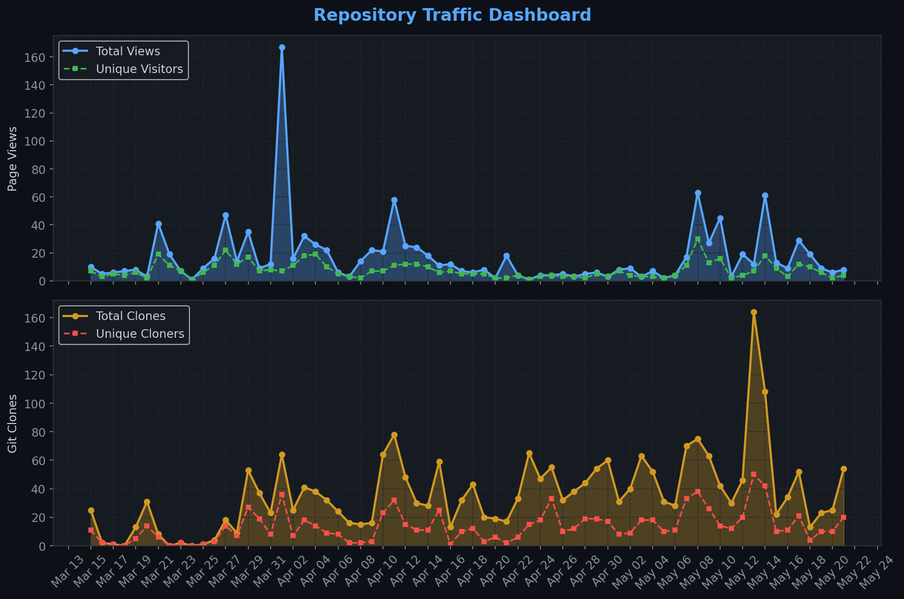
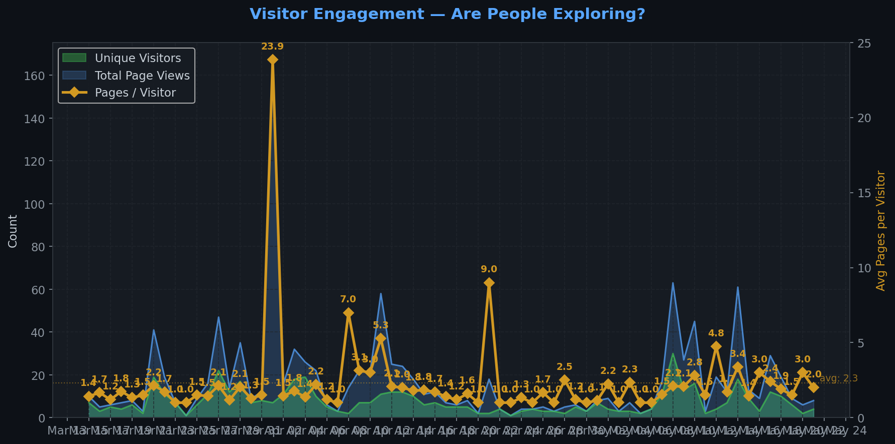
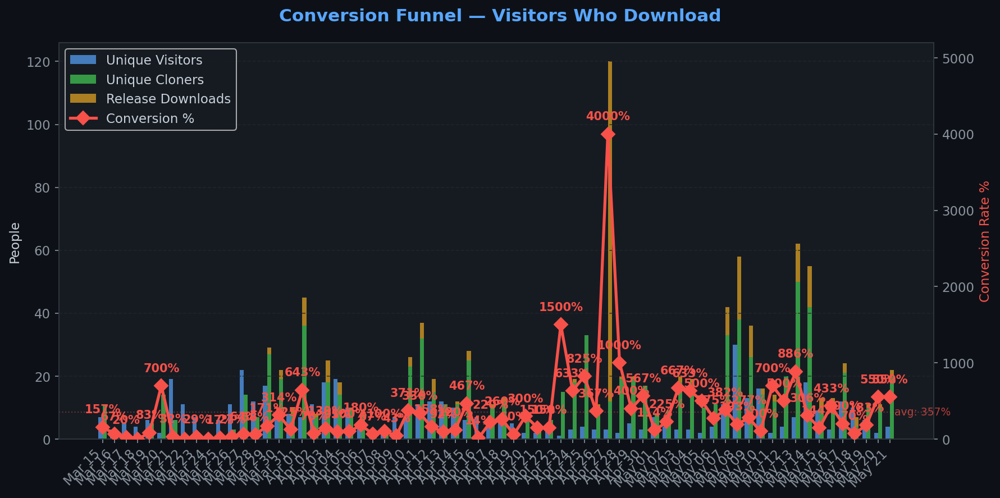
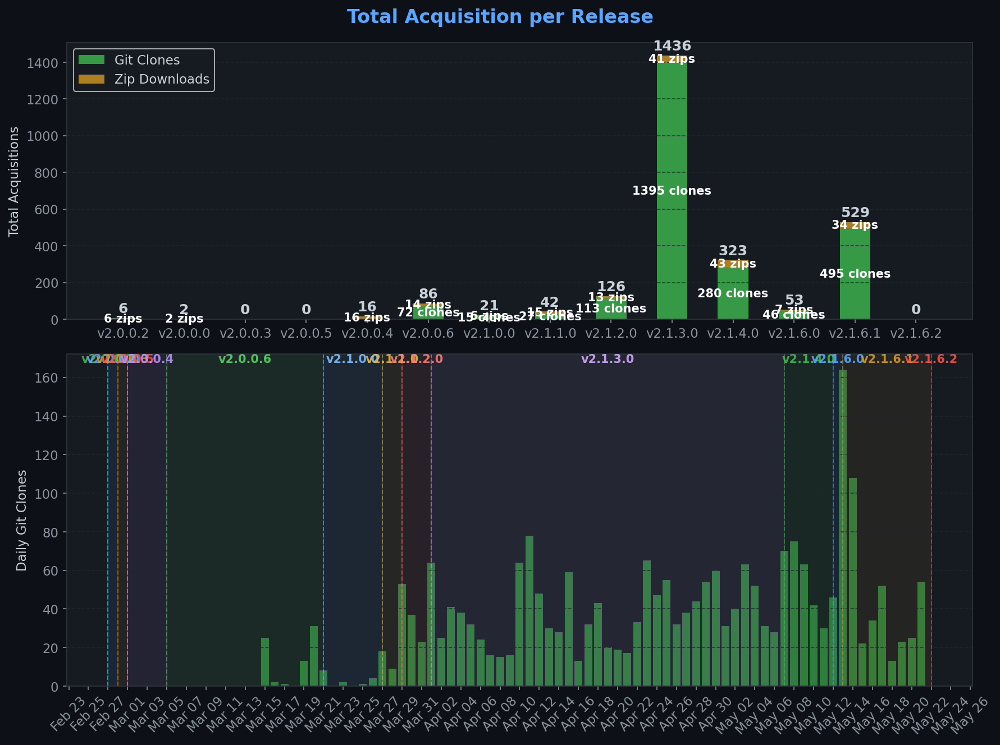
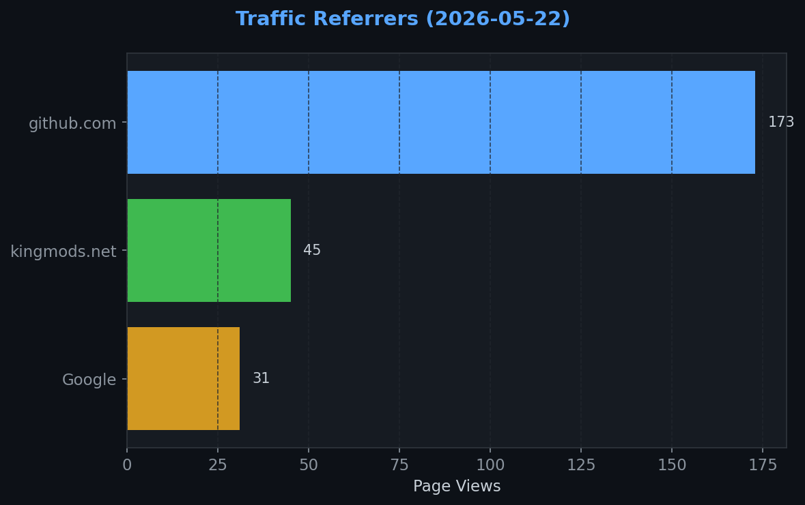
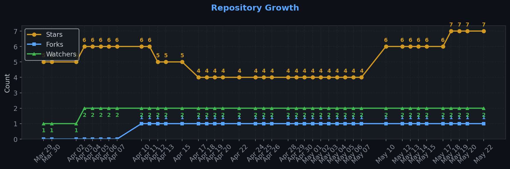

# Repository Traffic Dashboard

**Last updated:** 2026-05-22T18:54:20Z
**Days tracked:** 41 | **Download snapshots:** 149 (hourly)

---

## Views & Clones (14-day window, preserved forever)

| Metric | 14-Day Total | Unique |
|--------|-------------|--------|
| Page Views | 323 | 87 |
| Git Clones | 751 | 259 |

> **Engagement:** 3.7 pages per visitor (14-day avg)

---

## Visitor Engagement

> Higher = visitors exploring more pages. 1.0 = bounce. 3.0+ = deeply engaged.

---

## Conversion Funnel

> **14-day conversion:** 456 of 87 visitors cloned or downloaded (**524.1%**)
>
> Unique cloners: 259 | Release downloads: 197

---

## Total Acquisition per Release (Downloads + Clones)

| Channel | Count |
|---------|-------|
| Zip Downloads | 197 |
| Git Clones (14-day) | 751 |
| **Total Acquisitions** | **948** |

---

## Referrers

| Source | Views | Unique |
|--------|-------|--------|
| github.com | 173 | 44 |
| kingmods.net | 45 | 28 |
| Google | 31 | 11 |

---

## Repository Growth

| Metric | Current |
|--------|---------|
| Stars | 7 |
| Forks | 1 |
| Watchers | 2 |

---

## Top Pages (14-day)

| Page | Views | Unique |
|------|-------|--------|
| `/TheCodingDad-TisonK/FS25_RandomWorldEvents` | 187 | 79 |
| `/TheCodingDad-TisonK/FS25_RandomWorldEvents/issues` | 28 | 8 |
| `/TheCodingDad-TisonK/FS25_RandomWorldEvents/releases/tag/v2.1.4.0` | 23 | 19 |
| `/TheCodingDad-TisonK/FS25_RandomWorldEvents/releases/tag/v2.1.6.1` | 19 | 16 |
| `/TheCodingDad-TisonK/FS25_RandomWorldEvents/releases` | 11 | 9 |
| `/TheCodingDad-TisonK/FS25_RandomWorldEvents/issues/18` | 9 | 4 |
| `/TheCodingDad-TisonK/FS25_RandomWorldEvents/issues/17` | 6 | 2 |
| `/TheCodingDad-TisonK/FS25_RandomWorldEvents/issues/11` | 5 | 4 |
| `/TheCodingDad-TisonK/FS25_RandomWorldEvents/branches` | 2 | 2 |
| `/TheCodingDad-TisonK/FS25_RandomWorldEvents/releases/tag/v2.1.6.0` | 2 | 2 |

---

## Data Files

| File | Description | Granularity |
|------|-------------|-------------|
| [daily.json](daily.json) | Views & clones per day (never expires) | Daily |
| [downloads.json](downloads.json) | Release download snapshots | Hourly |
| [referrers.json](referrers.json) | Referrer snapshots | Daily |
| [metadata.json](metadata.json) | Stars, forks, watchers | Daily |
| [stats.json](stats.json) | Combined legacy snapshots | 6-hourly |

---
*Hourly download tracking + full dashboard with engagement metrics every 6 hours*
*Auto-generated by [traffic-stats.yml](../../.github/workflows/traffic-stats.yml)*
