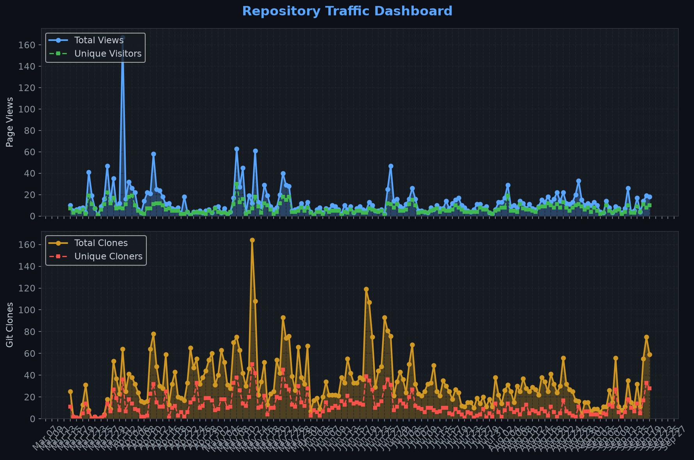
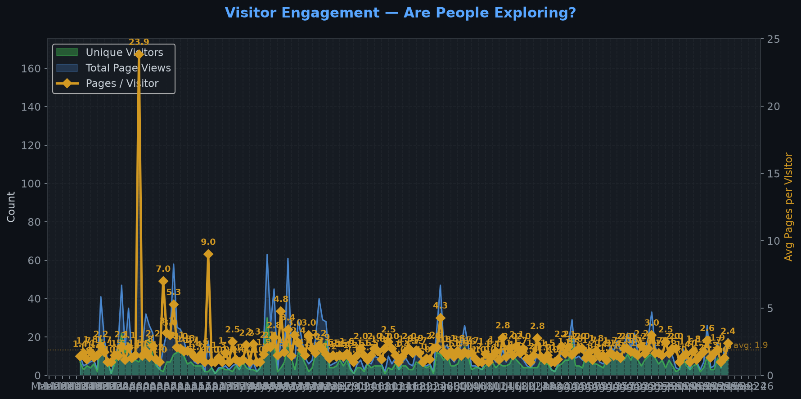
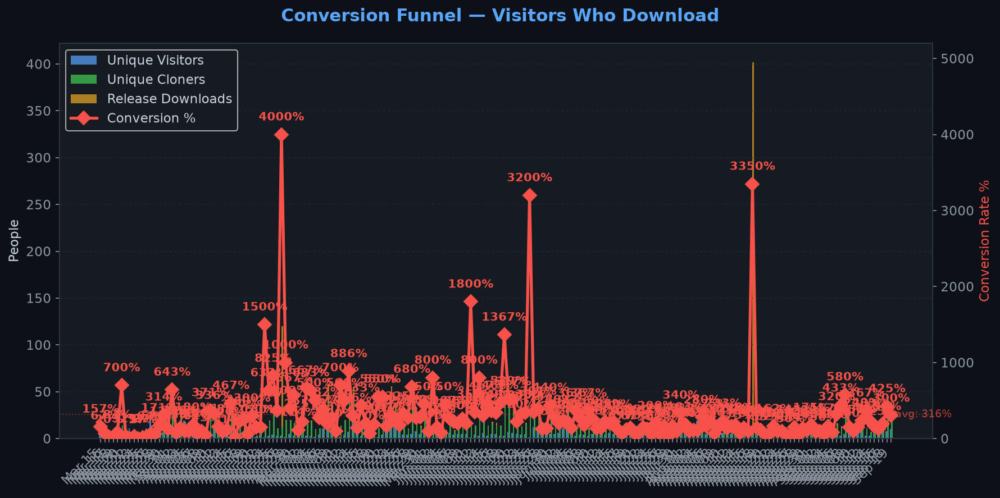
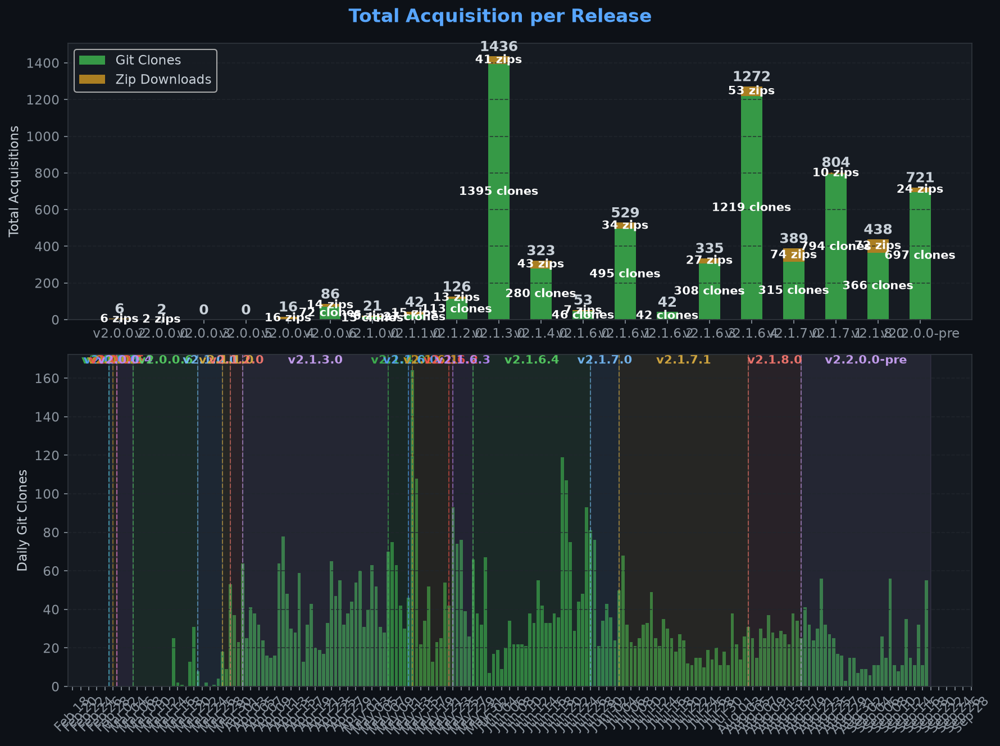
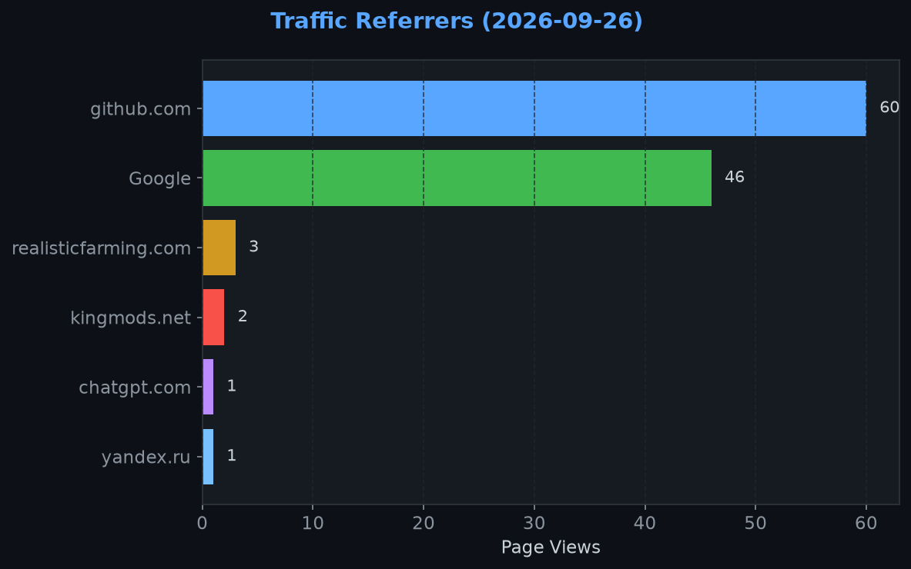
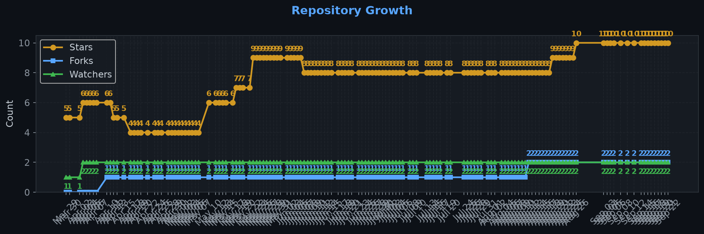

# Repository Traffic Dashboard

**Last updated:** 2026-08-09T18:38:25Z
**Days tracked:** 108 | **Download snapshots:** 384 (hourly)

---

## Views & Clones (14-day window, preserved forever)

| Metric | 14-Day Total | Unique |
|--------|-------------|--------|
| Page Views | 151 | 82 |
| Git Clones | 300 | 76 |

> **Engagement:** 1.8 pages per visitor (14-day avg)

---

## Visitor Engagement

> Higher = visitors exploring more pages. 1.0 = bounce. 3.0+ = deeply engaged.

---

## Conversion Funnel

> **14-day conversion:** 456 of 82 visitors cloned or downloaded (**556.0%**)
>
> Unique cloners: 76 | Release downloads: 380

---

## Total Acquisition per Release (Downloads + Clones)

| Channel | Count |
|---------|-------|
| Zip Downloads | 380 |
| Git Clones (14-day) | 300 |
| **Total Acquisitions** | **680** |

---

## Referrers

| Source | Views | Unique |
|--------|-------|--------|
| github.com | 88 | 48 |
| Google | 26 | 15 |
| kingmods.net | 18 | 12 |
| alice.yandex.ru | 3 | 1 |
| Bing | 1 | 1 |
| yandex.ru | 1 | 1 |

---

## Repository Growth

| Metric | Current |
|--------|---------|
| Stars | 8 |
| Forks | 1 |
| Watchers | 2 |

---

## Top Pages (14-day)

| Page | Views | Unique |
|------|-------|--------|
| `/Realistic-Farming/FS25_RandomWorldEvents` | 116 | 78 |
| `/Realistic-Farming/FS25_RandomWorldEvents/releases/tag/v2.1.7.0` | 11 | 9 |
| `/Realistic-Farming/FS25_RandomWorldEvents/releases/tag/v2.1.8.0` | 8 | 7 |
| `/Realistic-Farming/FS25_RandomWorldEvents/releases` | 5 | 4 |
| `/Realistic-Farming/FS25_RandomWorldEvents/issues` | 3 | 2 |
| `/Realistic-Farming/FS25_RandomWorldEvents/blob/master/README.md` | 2 | 2 |
| `/Realistic-Farming/FS25_RandomWorldEvents/blob/master/modDesc.xml` | 1 | 1 |
| `/Realistic-Farming/FS25_RandomWorldEvents/compare/524af7f41f26...7c2bf94d8f95` | 1 | 1 |
| `/Realistic-Farming/FS25_RandomWorldEvents/issues/13` | 1 | 1 |
| `/Realistic-Farming/FS25_RandomWorldEvents/pull/30` | 1 | 1 |

---

## Data Files

| File | Description | Granularity |
|------|-------------|-------------|
| [daily.json](daily.json) | Views & clones per day (never expires) | Daily |
| [downloads.json](downloads.json) | Release download snapshots | Hourly |
| [referrers.json](referrers.json) | Referrer snapshots | Daily |
| [metadata.json](metadata.json) | Stars, forks, watchers | Daily |
| [stats.json](stats.json) | Combined legacy snapshots | 6-hourly |

---
*Hourly download tracking + full dashboard with engagement metrics every 6 hours*
*Auto-generated by [traffic-stats.yml](../../.github/workflows/traffic-stats.yml)*
