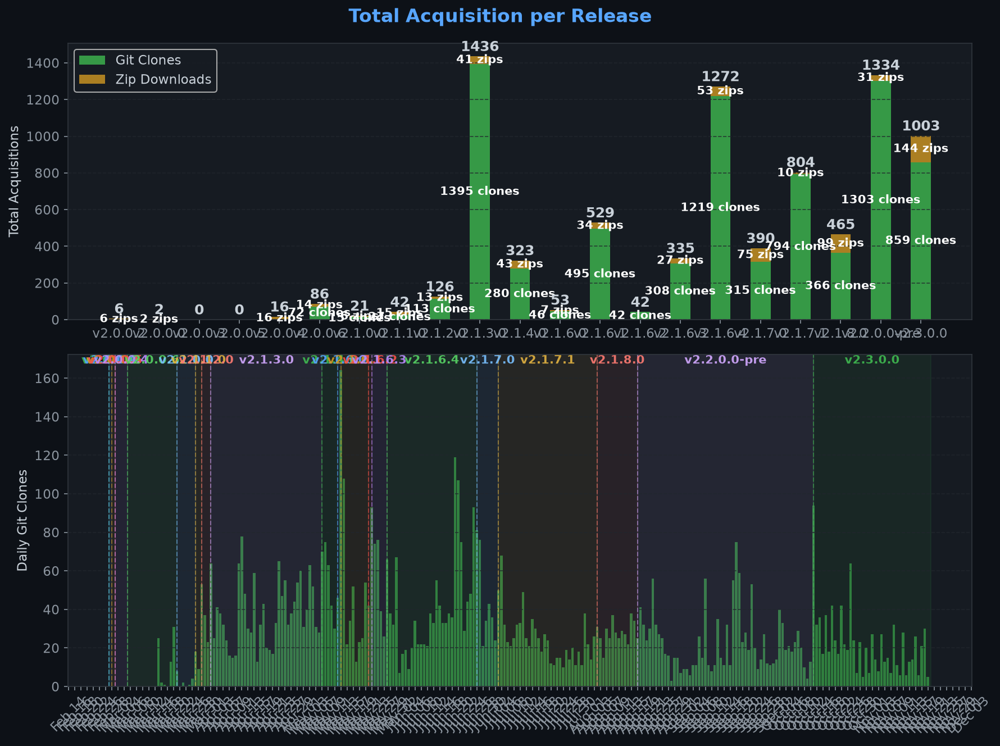

# Repository Traffic Dashboard

**Last updated:** 2026-11-25T00:22:15Z
**Days tracked:** 177 | **Download snapshots:** 650 (hourly)

---

## Views & Clones (14-day window, preserved forever)

| Metric | 14-Day Total | Unique |
|--------|-------------|--------|
| Page Views | 105 | 60 |
| Git Clones | 215 | 96 |

> **Engagement:** 1.7 pages per visitor (14-day avg)

---

## Visitor Engagement

> Higher = visitors exploring more pages. 1.0 = bounce. 3.0+ = deeply engaged.

---

## Conversion Funnel

> **14-day conversion:** 739 of 60 visitors cloned or downloaded (**1231.6%**)
>
> Unique cloners: 96 | Release downloads: 643

---

## Total Acquisition per Release (Downloads + Clones)

| Channel | Count |
|---------|-------|
| Zip Downloads | 643 |
| Git Clones (14-day) | 215 |
| **Total Acquisitions** | **858** |

---

## Referrers

| Source | Views | Unique |
|--------|-------|--------|
| github.com | 43 | 27 |
| Google | 14 | 9 |
| realisticfarming.com | 2 | 2 |
| Bing | 1 | 1 |
| alice.yandex.ru | 1 | 1 |
| search.brave.com | 1 | 1 |
| yandex.ru | 1 | 1 |

---

## Repository Growth

| Metric | Current |
|--------|---------|
| Stars | 10 |
| Forks | 2 |
| Watchers | 1 |

---

## Top Pages (14-day)

| Page | Views | Unique |
|------|-------|--------|
| `/Realistic-Farming/FS25_RandomWorldEvents` | 84 | 57 |
| `/Realistic-Farming/FS25_RandomWorldEvents/releases/tag/v2.3.0.0` | 14 | 14 |
| `/Realistic-Farming/FS25_RandomWorldEvents/releases` | 4 | 4 |
| `/Realistic-Farming/FS25_RandomWorldEvents/compare/v2.2.0.0-pre...v2.3.0.0` | 1 | 1 |
| `/Realistic-Farming/FS25_RandomWorldEvents/releases/tag/v2.2.0.0-pre` | 1 | 1 |
| `/Realistic-Farming/FS25_RandomWorldEvents/tree/master/icons` | 1 | 1 |

---

## Data Files

| File | Description | Granularity |
|------|-------------|-------------|
| [daily.json](daily.json) | Views & clones per day (never expires) | Daily |
| [downloads.json](downloads.json) | Release download snapshots | Hourly |
| [referrers.json](referrers.json) | Referrer snapshots | Daily |
| [metadata.json](metadata.json) | Stars, forks, watchers | Daily |
| [stats.json](stats.json) | Combined legacy snapshots | 6-hourly |

---
*Hourly download tracking + full dashboard with engagement metrics every 6 hours*
*Auto-generated by [traffic-stats.yml](../../.github/workflows/traffic-stats.yml)*
